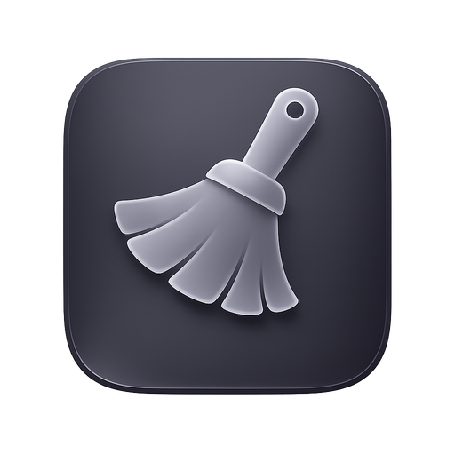

<div align="center">



# Tidy-App

**Find clutter. Review files faster. Reclaim storage safely.**


[](https://github.com/totondruppusu/tidy-app/stargazers)
[](https://github.com/totondruppusu/tidy-app/network/members)
[](https://github.com/totondruppusu/tidy-app/actions/workflows/ci.yml)
[](https://ko-fi.com/totondruppusu)

</div>

Tidy-App is a free, open-source, cross-platform desktop file organizer and cleanup tool.

It helps you scan folders, preview files, find duplicates, organize content, and clean up storage with safety controls and undo support.

 Everything runs locally on your machine. No cloud service is required, your files stay on your computer.

## Contents

- [Why Tidy-App](#why-tidy-app)
- [What It Does](#what-it-does)
- [Supported Workflows](#supported-workflows)
- [Getting Started](#getting-started)
- [Development](#development)
- [Testing](#testing)
- [Tech Stack](#tech-stack)
- [License](#license)

## Why Tidy-App

AI can help with many things, but cleanup still depends on your judgment. Tidy-App is built for the part that matters most: helping you inspect files quickly and make safer keep-or-delete decisions.

## What It Does

### Core features

| Area | Highlights |
| --- | --- |
| 💡 Smart scanning | Screenshots and memes, media, large stale files, hidden-file support, cached scans, sorting, grouping, extension filters |
| 👀 File preview | Images, videos, audio, text, PDFs, archives, Office documents, code |
| 🔍 Duplicate finder | Grouped matches, optional SHA-256 verification, minimum size thresholds |
| 🚀 Fast organization | Up to 5 saved destinations, tree/list workflows, local operation history |
| ⌨️ Keyboard-first speed | Arrow-key navigation, `1-5` quick-move slots, `Enter` reveal, `Space` play/pause, `Ctrl/Cmd + Arrow` video/audio time skip |
| 🔒 Safe cleanup | System trash, optional permanent delete, protected paths, persisted undo stack |

<details>
<summary><strong>Feature details</strong></summary>

### Smart Scanning

- Scan only the current folder or include subfolders
- Include hidden files and directories when needed
- Reuse cached scans when scan options match
- Sort by name, size, date, type, or extension
- Group files by type, extension, or duplicate set
- Filter by remembered or common extensions

### File Preview

- Images
- Videos
- Audio files
- Text files
- PDFs
- Archives
- Office documents
- Syntax-aware code and script previews with line numbers for common source and config files

On Windows, rich preview for Office documents requires LibreOffice to be installed. Without LibreOffice, Office files fall back to text extraction when possible.

Additional preview tools include image zoom, pan controls, media shortcuts, file reveal, and opening files in the default system app.

Supported preview extensions and filenames:

- Images: `jpg`, `jpeg`, `png`, `gif`, `bmp`, `webp`, `tiff`, `heic`, `heif`
- Video: `mp4`, `mov`, `mkv`, `webm`, `avi`, `wmv`, `m4v`, `mpeg`, `mpg`
- Audio: `mp3`, `wav`, `flac`, `aac`, `m4a`, `ogg`, `opus`, `aiff`, `wma`, `alac`
- Documents: `pdf`, `doc`, `docx`, `odt`, `rtf`, `ppt`, `pptx`, `key`, `pages`, `numbers`, `xls`, `xlsx`, `ods`, `odp`
- Archives: `zip`, `rar`, `7z`, `tar`, `gz`, `tgz`, `bz2`, `xz`, `zst`, `lz`, `lz4`, `cab`
- Plain text: `txt`, `log`, `csv`, `tsv`, `md`, `markdown`
- Code, script, and config preview: `json`, `yaml`, `yml`, `xml`, `htm`, `html`, `css`, `scss`, `sass`, `less`, `js`, `mjs`, `cjs`, `ts`, `mts`, `cts`, `jsx`, `tsx`, `vue`, `svelte`, `astro`, `ini`, `conf`, `cfg`, `toml`, `properties`, `env`, `sql`, `graphql`, `gql`, `py`, `rb`, `php`, `java`, `kt`, `kts`, `groovy`, `scala`, `clj`, `cljs`, `edn`, `go`, `rs`, `c`, `h`, `cpp`, `cc`, `cxx`, `hpp`, `hh`, `hxx`, `cs`, `swift`, `dart`, `lua`, `pl`, `pm`, `r`, `sh`, `bash`, `zsh`, `fish`, `ps1`, `psm1`, `psd1`, `bat`, `cmd`, `cmake`, `m`, `mm`
- Special filenames with rich text/code preview: `Dockerfile`, `Makefile`, `GNUmakefile`, `Justfile`, `CMakeLists.txt`, `Procfile`, `Gemfile`, `Rakefile`, `.env*`, `.gitignore`, `.gitattributes`, `.gitmodules`, `.editorconfig`, `.npmrc`, `.yarnrc`, `.bashrc`, `.bash_profile`, `.profile`, `.zshrc`, `.eslintrc*`, `.prettierrc*`, `.stylelintrc*`, `.babelrc*`

### Duplicate Finder

- Group matching duplicate files
- Use optional SHA-256 hash verification for stronger accuracy
- Configure minimum file-size thresholds
- Review duplicate groups before taking action

### Fast Organization

- Save up to 5 destination slots
- Move files into saved destinations
- Use tree or list workflows depending on the cleanup task
- Track actions in local operation history

### Keyboard-First Speed

- Move through files with `Arrow Left` and `Arrow Right`
- Trash the current file with `Arrow Up`
- Undo the last action with `Arrow Down`
- Send files to destination slots with `1-5`
- Reveal the current file in the system file manager with `Enter`
- Play or pause video with `Space`
- Skip forward or backward 10 seconds in audio or video with `Ctrl/Cmd + Arrow Left/Right`

### Safe Cleanup

- Send files to the system trash
- Permanently delete only when enabled in settings
- Trash folders from tree view
- Undo recent actions from a persisted undo stack
- Keep up to 20 recent undo entries
- Block destructive actions in protected paths by default
- Store operation history locally for auditability

</details>

## Supported Workflows

Tidy-App is useful when you want to:

- Clean a messy folder or backup drive
- Find duplicate files and media
- Review large folders quickly
- Organize screenshots, memes, documents, archives, and videos
- Preview PDFs, Office files, archives, and media from one interface
- Free up storage without blindly deleting files
- Keep cleanup actions reversible where possible

## Getting Started

### Installation

#### macOS

1. Download the latest release matching your CPU:
   - `aarch64` for Apple Silicon
   - `x64` for Intel
2. Install the app
3. Right-click the app and choose `Open`
4. If macOS blocks the app, go to `System Settings > Privacy & Security` and choose `Open Anyway`

#### Windows

1. Download the latest `x64` release
2. Install the app
3. Install LibreOffice if you want rich previews for Office, RTF, and OpenDocument files

## Development

### Prerequisites

#### macOS

- Node.js `18+`
- Rust stable toolchain
- Xcode Command Line Tools

Install Xcode Command Line Tools if needed:

```bash
xcode-select --install
```

#### Windows

- Node.js `18+`
- Rust stable toolchain
- Microsoft C++ Build Tools
- WebView2 Runtime
- LibreOffice if you want to test rich Office document previews locally

#### Linux

- Node.js `18+`
- Rust stable toolchain
- Native libraries required by Tauri

Install common Linux dependencies:

```bash
sudo apt-get update
sudo apt-get install -y \
  pkg-config \
  libglib2.0-dev \
  libgtk-3-dev \
  libwebkit2gtk-4.1-dev \
  libayatana-appindicator3-dev \
  librsvg2-dev \
  patchelf
```

#### Android

- Node.js `18+`
- Rust stable toolchain
- Java `17` to `21` with `21` recommended
- Android Studio with the Android SDK and platform tools
- An emulator or physical Android device if you want to run the app locally

### Install dependencies

```bash
npm install
```

### Run locally

Run the web UI only:

```bash
npm run dev
```

Run the desktop app with Tauri:

```bash
npm run tauri dev
```

Run the Android app on an emulator or connected device:

```bash
npm run android:dev
```

These Android npm scripts automatically prefer Android Studio's bundled JDK and other compatible macOS JDK installs, even if your shell `JAVA_HOME` still points to an old SDKMAN Java.

Initialize the Android project files:

```bash
npm run android:init
```

### Build

Build the frontend bundle:

```bash
npm run build
```

Build the desktop application:

```bash
npm run tauri build
```

Use this only for desktop builds. It does not produce Android packages.

Build Android APK/AAB artifacts:

```bash
npm run android:build
```

If you run `tauri android ...` directly instead of the npm scripts, make sure `JAVA_HOME` points to a Java 17-21 JDK first. Android Studio's bundled JDK is a good default on macOS:

```bash
export JAVA_HOME="/Applications/Android Studio.app/Contents/jbr/Contents/Home"
```

> [!TIP]
> Tauri is configured to run the frontend build before packaging, so `npm run tauri build` is the normal release build command.

> [!TIP]
> For Android, use `npm run android:build` instead of `npm run tauri build`.

> [!NOTE]
> Android now uses the platform document-tree picker (`ACTION_OPEN_DOCUMENT_TREE`) and a SAF-backed file flow for scanning, moving, trashing, and undoing file actions. Desktop path handling on macOS and Windows remains unchanged.

> [!NOTE]
> Current Android limitations:
> Android may refuse storage roots in the folder picker with a system “Can’t use this folder” message. Choose a real subfolder inside that location instead.
> duplicate scans are not enabled yet, folder-trash actions are still desktop-only, and opening a file in an external app or file manager is not wired up yet.

## Testing

Run frontend unit and integration tests:

```bash
npm run test
```

Run coverage:

```bash
npm run test:coverage
```

Run Playwright smoke tests:

```bash
npm run test:e2e
```

Run Rust tests:

```bash
npm run test:rust
```

Run the full test suite:

```bash
npm run test:all
```

## Tech Stack

| Layer | Tools |
| --- | --- |
| Desktop shell | Tauri 2 |
| Frontend | React 18, TypeScript, Vite |
| Native/backend | Rust |
| Testing | Vitest, Testing Library, Playwright |

## Star History

[](https://www.star-history.com/#totondruppusu/tidy-app&Date)

## License

Released under the [AGPL-3.0-only](LICENSE) license.
